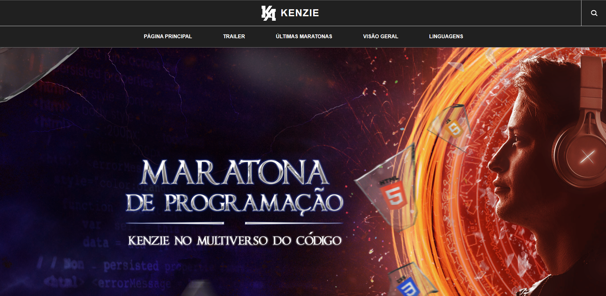

# KENZIE

> MARATONA DE PROGRAMAÇÃO - KENZIE NO MULTIVERSO DO CÓDIGO

Projeto construído no evento Maratona de Programação da Kenzie.

[🔗 Clique aqui para acessar a página](https://ronald-ca.github.io/multiverso-programacao/)

## 📌 Tecnologias

- HTML
- CSS
- JS
- Git e GitHub

## 📫 Contato

ronaldcamargodev@gmail.com
